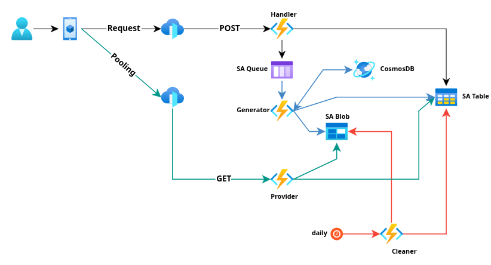

# PoC - Report Async Generator

## Objective
Generate a sample PDF in background, using a serverless approach (Function App) and resources available at a Storage Account (table, queue and blob storage).
User request a report in a POST endpoint, and receives an UUID to query it back in a GET endpoint. If the report is COMPLETED, a pre-signed URL is returned to retrieve the file direcly from blob storage.

## Technical Context    
### Technologies
*   Java 17 + Azure Functions v4.
*   Azure Table to maintain the generation lifesycle
*   Azure Queue to allow an event based generation 
*   Azure Blob Storage for file storage
*   Guice for lightweight dependency injection
   
## Proposed Architecture
### Overview 
 
* Request Flow
    * User requests the report through the POST endpoint
    * **_Handler_** Function receives the request, registers it in the processing control table (SA Table) with PENDING status, posts a message to the queue (SA Queue), responds HTTP 202 (Accepted) to the user with processing details (mainly the request ID for future consultation), or HTTP 400 (Bad Request) if it finds errors in the request.
    * **_Generator_** Function starts processing the message from the queue, changes the control table status to PROCESSING, directs the report generation to the corresponding Use Case. At the end of the processing, it changes its status to COMPLETED and saves the report content (SA Blob), or INVALID (request issues) or FAILED (server issues) without saving its content.
    * If the user queries the report through the GET endpoint (passing the request ID), the **_Provider_** Function queries the processing control table (SA Table) for the report generation status, returning the corresponding HTTP code:
      * 404 (Not found) if the ID was not found in the processing table
      * 422 (Unprocessable entity) if the processing finished with an error (INVALID state), caused by invalid payload informations.
      * 500 (Internal Server Error) if the processing finished with an error (FAILED state), or even if a **timeout** occurred within the generation process.
      * 204 (No content) if it has already been removed from blob storage (COMPLETED state)
      * 200 (OK) if it exists but is still being processed (PENDING or PROCESSING state)
      * 201 (Created) if it finished successfully (COMPLETED state), with processing details (size, total time), and a direct access URL to the blob storage, with only download permission and valid for 10 minutes.
    * Daily the **_Cleaner_** Function will be executed at 3:00 am which will query all reports older than 10 days and will perform their physical removal (SA Blob and SA Table) to reduce resource usage.

### Summarized Flow: 
1.  User calls `POST /api/report` with payload for background report generation.
1.  Function: 
    1.  Deserializes request. 
    1.  Validates data. 
    1.  Posts a message to the queue for background generation and returns RequestId for polling
1.  **Generator** Function is triggered by the message
1.  Executes use case. 
1.  Saves the report in blob storage
1.  User calls `GET /api/report/{requestId}` to query for generation status.
1.  Provider Function responds with the status, with an access URL if it is ready
2.  

## Blob Storage Lifecycle Policies
A great way to keep your resources optimized is reduce usage costs, removing data that's not relevant any more. Blob Storage has a [Lifecycle Management](https://learn.microsoft.com/en-us/azure/storage/blobs/lifecycle-management-overview) allowing apply rules to maintain data in different tiers, or "cooliers" tiers, that retention costs are gradually lower, but retrieval is costly. This is a good approach for data that needs to be retained for auditing purposes, given that access to this data has decreased over time.

Below is a example of changing a blob tier to Cold, when latest modification was 30 days ago. And after a year (365 days) it gets tagged with `pending-logical-delete=true` to be logicaly deleted before . Connecting to "Cleaner" function, who runs daily to search for blobs with `pending-logical-delete=true`, removes phisically the record from Table Storage. And the last policy in blob storage removes the blob.

```
{
  "enabled": true,
  "rules": [
    {
      "name": "30d-hot-to-cold",
      "enabled": true,
      "type": "Lifecycle",
      "definition": {
        "actions": {
          "baseBlob": {
            "tierToCold": {
              "daysAfterModificationGreaterThan": 30
            }
          }
        },
        "filters": {
          "blobTypes": ["blockBlob"],
          "prefixMatch": ["generated/"]
        }
      }
    },
    {
      "name": "365d-add-pending-delete-tag",
      "enabled": true,
      "type": "Lifecycle",
      "definition": {
        "actions": {
          "baseBlob": {
            "setBlobIndex": [
              {
                "name": "phase",
                "value": "pending-logical-delete"
              }
            ]
          }
        },
        "filters": {
          "blobTypes": ["blockBlob"],
          "prefixMatch": ["generated/"]
        }
      }
    },
    {
      "name": "370d-physical-delete",
      "enabled": true,
      "type": "Lifecycle",
      "definition": {
        "actions": {
          "baseBlob": {
            "delete": {
              "daysAfterModificationGreaterThan": 370
            }
          }
        },
        "filters": {
          "blobTypes": ["blockBlob"],
          "prefixMatch": ["generated/"]
        }
      }
    }
  ]
}
```
  
## Local Setup
* Please follow [Microsoft Docs - Code and test Azure Functions locally](https://learn.microsoft.com/en-us/azure/azure-functions/functions-develop-local?pivots=programming-language-java) to setup your local environment. I developed in Visual Studio Code with azurite to emulate Storage Account resources locally.
* import [Postman Collection](./docs/postman_collection.json)
* After everything set up, start debugging and try the POST endpoint.
* You can run `mvn gatling:test` in a separated terminal to run integration tests

## Links 
* [Azure Storage Account Tables](https://learn.microsoft.com/en-us/azure/storage/tables/table-storage-overview)
* [Azure Storage Account Queues](https://learn.microsoft.com/en-us/azure/storage/queues/storage-queues-introduction)
* [Azure Storage Account Blob Storage](https://learn.microsoft.com/en-us/azure/storage/blobs/storage-blobs-introduction)
* [Azure Function HTTP Triggers](https://learn.microsoft.com/en-us/azure/azure-functions/functions-bindings-http-webhook-trigger)
* [Azure Function Blob Storage Triggers](https://learn.microsoft.com/en-us/azure/azure-functions/functions-bindings-storage-blob-trigger)
* [Azure Function Queue Triggers](https://learn.microsoft.com/en-us/azure/azure-functions/functions-bindings-storage-queue-trigger)
* [Azure Function Tables SDK](https://learn.microsoft.com/en-us/java/api/overview/azure/data-tables-readme)
* [Azure Function Blob SDK](https://learn.microsoft.com/en-us/java/api/overview/azure/storage-blob-readme)
